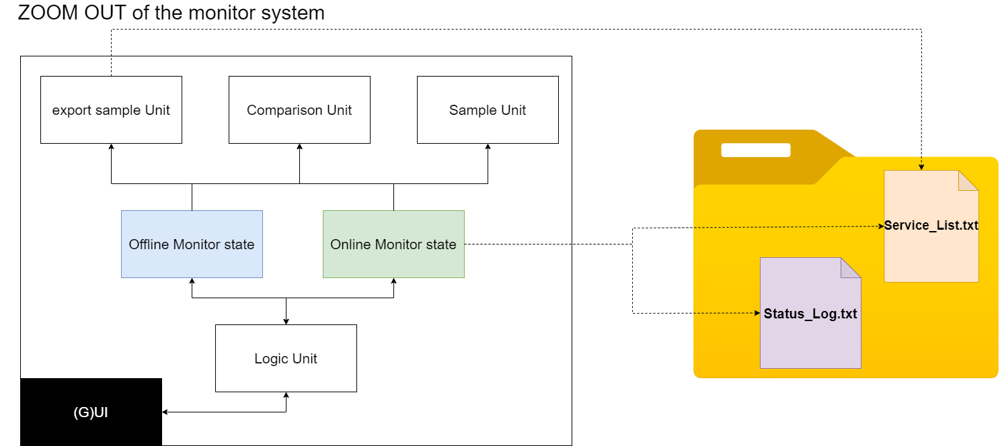
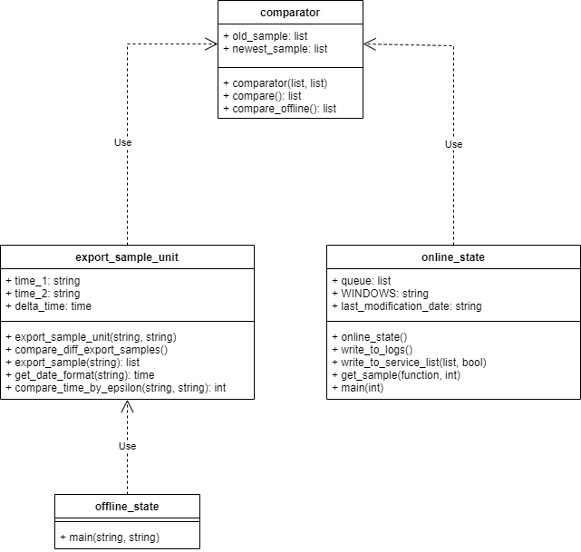

# Service Monitor 


<!-- TABLE OF CONTENTS -->
<details open="open">
  <summary>Content</summary>
  <ol>
    <li><a href="#about-the-project">About The Project</a></li>
    <li><a href="#plot-graph">System's Structure</a></li>
    <li><a href="#code-details">Code Details</a></li>
    <li><a href="#how-to-run">How  to run</a></li>
    <li><a href="#languages-and-tools">Languages and Tools</a></li>
    <li><a href="#acknowledgements">Acknowledgements</a></li>
    <li><a href="#contact">Contact</a></li>
  </ol>
</details>

----------------

<!-- ABOUT THE PROJECT -->
# About The Project

In this project we had to design a software which monitors the running services
onto the computer, considering two separate operating systems (ubuntu-linux, windows)
making this software cross-platform.

### software details
The software has to modes: 

#### ONLINE MODE
In this mode, the user is asked to enter X seconds, when every X 
seconds the software samples the running services on the operating system, 
and then insert it to a file. After each taken sample the software will
compare between the current taken sample and the previous one, which operates by the compare unit.
These differences between the two will be inserted into a log file as well.

#### OFFLINE MODE
In this mode, the user is asked to enter two dates in which a sampled has occurred,
if the sample date entered by the user isn't compatible to any of the 
samples date, then the software rounds the given time stamps to the closest
sample among a 5 seconds interval. Afterwards, the software
compares the two samples and present it to the user.


---------------

<!-- System's Structure -->
## System's Structure
This is a glance from above for system's architecture. 
<p align="center">

</p>

### explanation

The user communicates with the software through UI, and choose for mode.
The online mode turns every X seconds to the sample and comparison units.
The offline mode extract with the export unit two samples, and turns to the comparison unit with them.

The following picture depict how the online mode actually works:

<p align="center">

</p>

Every X seconds a sample is taken and given. Each sample 
is written in log file - 'Service_List.txt' and then sent 
to the queue data-structure, which its size is 2 samples.
When the queue fully reaches size 2, after a new incoming sample
is reaching, the two samples in the queue are sent to comparison.
The received log from the comparison is represented to the user, 
if the log isn't empty - meaning the there are changes in services' status.
When there is a new incoming sample to the queue, the first sample will 
be removed from the queue, the last sample becomes the old sample
and then the new sample will be inserted to the queue.
Note that this procedure recurrent throughout the entire running.

The following picture depict a glance about how the offline mode works:

<p align="center">

</p>

The user enters through the UI 2 time-stamps - two different dates, 
in which two samples were taken. The time-stamps are transferred
to the management of the online mode. From there, they will be
transferred to the export sample unit, which takes the closest
samples among a 5 seconds interval. If nothing to be found a
notification will pop up back to the user.
Two samples are returned from the export sample unit, and then
transferred to the comparison unit which returns a changes log, 
that will be presented to the user. 


---
<!-- SECURITY -->
## Security

- In order to secure our software from foreigner sabotaging, we have done the following steps: 

  1. In online mode, our software just writes to the file, and each comparison
  is made by a temporary save in the list data-structure for each taken sample.
  2. If the log file has deleted or changed, and it wasn't the software itself, a 
  warning notification will pop up. 
  

- We have thought about more ways to improve software's security,
  by doing the following:
  1. Save hash for the files (for instance, in a database), such that if a user will change something
     in the files when the software isn't active, if we won't be 
     able to find the hash or files are touched - a notification will pop up.
  2. Convert the code files to exe files and encrypt the data.  

---
<!-- code-details -->


## Code Details


Unified Modeling Language (UML) :

This diagram follows the system's architecture, which can be seen above.

<p align="center">

</p>

---------

<!-- how-to-run -->
# How to run


First, it's important to make sure you clone this project in Pycharm through Terminal.
To be sure:
```
git clone https://github.com/amirg00/Service-Monitor.git
```
Now, **make sure that you are inside service-monitor directory**.

Afterwards, run main.py.

You can do that as following to run through terminal:

```
python main.py
```

Then the software manual will appear.

_**Python Version:**_ ```3.9```

---------


## Languages and Tools

 <div align="center">
 <code></code>
 <code></code>
 <code></code>
 </div>


<!-- ACKNOWLEDGEMENTS -->
## Acknowledgements
* [Project-Book](system_desing/project_book.pdf)
* [Python](https://www.python.org/)
* [Git](https://git-scm.com/)
* [Pycharm](https://www.jetbrains.com/pycharm/)
* [Git-scm](https://git-scm.com/book/en/v2/Getting-Started-Installing-Git)


<!-- CONTACT -->
## Contact <small>[Top▲](object-oriented-programming-exercise-3)</small>


 Amir - [here](https://github.com/amirg00/)
 
 Simcha - [here](https://github.com/SimchaTeich)

Project Link: [here](https://github.com/amirg00/Simple-Chat)

___

Copyright © _This Project last modified on March 30, 2022, by [Amir](https://github.com/amirg00/) & [Simcha](https://github.com/SimchaTeich)_.